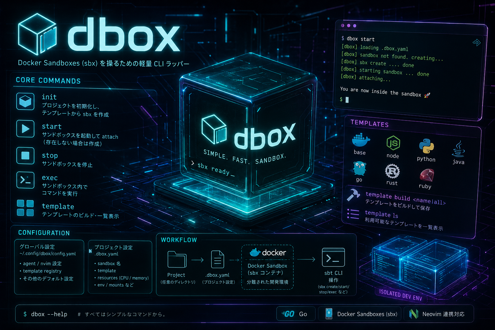

# dbox

`dbox` は [Docker Sandboxes (`sbx`)](https://docs.docker.com/desktop/features/sandbox/) の軽量ラッパーCLIです。



## 概要

`dbox` は以下の課題を解決します：

1. **sbx の使い方を忘れる** → 単純なコマンドインターフェースでラップ
2. **リポジトリによって必要な環境が変わる** → 言語検出からテンプレート作成まで自動化
3. **複数言語のリポジトリに対応** → 設定ファイルの組み合わせから必要なツールチェーンを自動判別

### 機能

| コマンド | 説明 |
|----------|------|
| `dbox init` | 言語検出 → テンプレート自動作成 → `sbx create` |
| `dbox start` | サンドボックスを起動（停止中→起動、未作成→作成） |
| `dbox stop` | サンドボックスを停止 |
| `dbox stop --all` | `dbox-` で始まる全サンドボックスを一括停止 |
| `dbox prune` | `dbox-` 関連リソース（sandbox/template/image）を一掃 |
| `dbox exec <cmd>` | サンドボックス内でコマンド実行 |
| `dbox template build --lang=<lang>` | 言語別 Docker イメージをビルド |
| `dbox template ls` | sbx テンプレート一覧を表示 |

---

## インストール

### 前提条件

- Go 1.24 以上
- [Docker Sandboxes (`sbx`)](https://docs.docker.com/desktop/features/sandbox/) がインストール済み

### ビルド

```bash
# リポジトリをクローン
git clone <repository-url>
cd sbx-template

# ビルド
go build -o dbox ./cmd/dbox/

# パスの通ったディレクトリに配置
mv dbox /usr/local/bin/
```

---

## クイックスタート

```bash
# カレントディレクトリの言語を自動検出して初期化
dbox init

# エージェントと言語を指定（複数言語はカンマ区切り）
dbox init --agent=opencode --lang=node,go

# サンドボックスを起動
dbox start

# サンドボックス内でコマンド実行
dbox exec "go version"


# サンドボックスを停止
dbox stop

# 全 dbox リソースを一掃
dbox prune
```

### dry-run モード

実際のコマンドを実行せずに動作確認ができます：

```bash
dbox init --dry-run
dbox start --dry-run
```

---

## コマンドリファレンス

### `dbox init [path]`

プロジェクトを初期化し、サンドボックスを作成します。

| フラグ | 短縮 | 既定値 | 説明 |
|--------|------|--------|------|
| `--agent` | `-a` | グローバル設定の値 | 使用するAIエージェント |
| `--lang` | `-l` | `auto` | 使用言語（autoで自動検出, `node,go`のように複数指定可） |
| `--publish` | | | ポートを公開（複数指定可, 例: `8080` または `3000:8080`） |

| `--dry-run` | `-n` | `false` | 実際のコマンドを実行せず表示のみ |

**言語検出ロジック**（多言語対応）：

1. **設定ファイルの存在検出**: `package.json` → Node, `go.mod` → Go, `Cargo.toml` → Rust, 等
   - 複数の設定ファイルが見つかれば、全ての言語を有効化
   - 例: `package.json` + `go.mod` → `[node, go]`
2. **拡張子の出現頻度による推定**: 全ファイルの5%以上を占める拡張子を全て検出
3. **該当なし** → base（最小構成）

**テンプレート名**: 検出された言語をアルファベット順に結合
- `[go]` → `dbox-go`
- `[node, go]` → `dbox-go-node`

### `dbox start [sandbox-name]`

サンドボックスを起動します。

| 状態 | 動作 |
|------|------|
| サンドボックスが存在しない | 新規作成してからアタッチ |
| 停止中 | `sbx run` で起動・アタッチ |
| 実行中 | そのままアタッチ |

| フラグ | 説明 |
|--------|------|
| `--publish` | ポートを公開（複数指定可, 例: `8080` または `3000:8080`） |


### `dbox stop [sandbox-name]`

サンドボックスを停止します。

| フラグ | 短縮 | 説明 |
|--------|------|------|
| `--all` | `-a` | `dbox-` で始まる全サンドボックスを一括停止 |

### `dbox prune`

`dbox-` で始まる全リソース（サンドボックス・sbxテンプレート・Dockerイメージ）を
停止・削除して初期状態に戻します。

### `dbox exec <command>`

サンドボックス内でコマンドを実行します。

```bash
dbox exec "go version"
dbox exec "node --version"
dbox exec "ls -la /workspace"
```

### `dbox template build --lang=<lang>`

Docker イメージをビルドし、sbx テンプレートとしてロードします。

| フラグ | 短縮 | 既定値 | 説明 |
|--------|------|--------|------|
| `--lang` | `-l` | `base` | ビルドする言語（allで全言語, `node,go`で合成） |

例：
```bash
# ベースイメージをビルド
dbox template build

# Go イメージをビルド
dbox template build --lang=go

# 複数言語の合成イメージをビルド
dbox template build --lang=node,go

# 全言語を一括ビルド
dbox template build --lang=all
```

### `dbox template ls`

sbx に登録済みのテンプレート一覧を表示します。

---

## 設定ファイル

### グローバル設定: `~/.config/dbox/config.yaml`

```yaml
default_agent: opencode
template:
  registry: docker/sandbox-templates
```

### ネットワークポリシー設定

Docker Sandboxes のネットワークポリシーにより、サンドボックスから外部への通信はデフォルトで制限されます。
`.dbox.yaml` の `network.allowed_domains` に許可したいホストを指定してください。

- **エージェント既定値**: エージェントに応じたドメイン（例: opencode → `opencode.ai:443`）は自動で許可されます
- **ユーザー追加**: ユーザーが `network.allowed_domains` に指定したドメインはエージェント既定値に追加して許可されます
- **適用タイミング**: `dbox init` / `dbox start` 実行時に `sbx policy allow network` で適用されます

```yaml
# 特定のホストのみ許可（推奨）
network:
    allowed_domains:
        - internal-api.example.com:443      # 社内APIサーバー
        - "*.internal.tools:443"            # 社内ツールの全サブドメイン

# 特定のホスト + パッケージレジストリを許可
# network:
#     allowed_domains:
#         - opencode.ai:443                 # opencode エージェント（自動追加されるため通常は不要）
#         - github.com:443                  # GitHub
#         - registry.npmjs.org:443          # npm レジストリ

# 全通信を許可（セキュリティ注意）
# network:
#     allowed_domains:
#         - "**"                            # すべての外部ホストへの通信を許可

### プロジェクト設定: `.dbox.yaml`（プロジェクトルートに自動生成）

```yaml
version: 2
agent: opencode
langs:
    - go
    - node
template: dbox-go-node
sandbox_name: dbox-opencode-my-project
clone: true
resources:
    cpus: 0       # 0 = auto
    memory: ""    # 空文字 = sbx デフォルト
network:
    allowed_domains:
        - opencode.ai:443      # エージェント通信の許可（opencode は自動追加）
        - internal.example.com:443   # 社内ツール等へのアクセス
```

---

## アーキテクチャ

```
dbox init
  → 言語検出 (detect.Detect)
     → 設定ファイルスキャン: package.json, go.mod, ...
     → 拡張子スキャン: .go, .ts, .py, ...
     → MultiResult{ Languages: [go, node], TemplateName: "dbox-go-node" }
  → テンプレート確認 & ビルド
     → sbx template ls でキャッシュ確認
     → なければ docker build (base.Dockerfile + snippets/*.snippet)
     → docker save | sbx template load で sbx に登録
  → .dbox.yaml 保存 (version: 2, langs: [go, node])
  → sbx create --template=dbox-go-node opencode /path
```

### テンプレート階層

```
docker/sandbox-templates:opencode-docker (sbx 公式ベース)
  └── dbox-base:latest
        ├── dbox-node:latest (Node.js 22)
        ├── dbox-go:latest (Go 1.24)
        ├── dbox-python:latest (Python 3)
        ├── dbox-java:latest (OpenJDK 21 + Maven)
        ├── dbox-rust:latest (Rust)
        ├── dbox-ruby:latest (Ruby + Bundler)
        └── dbox-go-node:latest (合成: 言語の組み合わせに応じて動的生成)
```

### テンプレートカスタマイズ

テンプレートは以下の優先順位で探索されます：

1. 実行ファイルからの相対パス（`../templates/`）
2. カレントディレクトリ（`./templates/`）
3. グローバル設定ディレクトリ（`~/.config/dbox/templates/`）← 埋め込みテンプレートが自動展開

独自の `base.Dockerfile` や `<lang>.Dockerfile` / `snippets/<lang>.snippet` を任意の場所に配置することで、
デフォルトのテンプレートを上書きできます。

---

## プロジェクト構造

```
.
├── cmd/dbox/
│   ├── main.go       # エントリポイント、rootCmd
│   ├── init.go       # init コマンド（言語検出、テンプレート確認、sbx create）
│   ├── start.go      # start コマンド
│   ├── stop.go       # stop / stop --all コマンド
│   ├── prune.go      # prune コマンド（全リソース一掃）
│   ├── exec.go       # exec コマンド
│   ├── template.go   # template build/ls コマンド
│   └── help.go       # カスタムヘルプ出力
├── internal/
│   ├── config/       # 設定ファイルの読み書き（yaml）
│   ├── detect/       # 多言語検出ロジック（設定ファイル + 拡張子）
│   ├── sandbox/      # sbx コマンドラッパー
│   └── template/     # Docker ビルド、スニペット合成
├── templates/
│   ├── base.Dockerfile       # sbx公式ベース
│   ├── node.Dockerfile       # Node.js 22
│   ├── go.Dockerfile         # Go 1.24
│   ├── python.Dockerfile     # Python 3 + pip
│   ├── java.Dockerfile       # OpenJDK 21 + Maven
│   ├── rust.Dockerfile       # Rust
│   ├── ruby.Dockerfile       # Ruby + Bundler
│   └── snippets/
│       ├── node.snippet      # 合成テンプレート用スニペット
│       ├── go.snippet
│       ├── python.snippet
│       ├── java.snippet
│       ├── rust.snippet
│       └── ruby.snippet
├── embed.go          # テンプレート埋め込み (go:embed)
├── go.mod
└── plan.md           # 設計書
```

---

## テスト

```bash
# 全テスト実行
go test ./... -v

# カバレッジ計測
go test ./... -coverprofile=coverage.out
go tool cover -html=coverage.out
```
